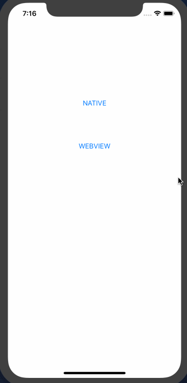
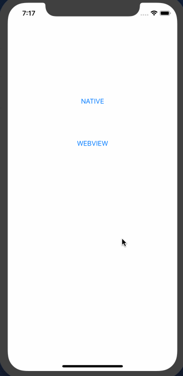

# Amazon Pay モバイル サンプルアプリ iOS(iPhone, iPad)版
下記のiOSアプリの実装です。
https://github.com/tauty/amazonpay-mobile-sample_server

## Native版
通常のiOSアプリ向けの実装サンプルです。  
アプリ側で商品の購入数を選んで受注情報を作成し、SFSafariViewを起動してAmazon Payへのログイン・住所＆支払い方法の選択・購入を実施し、またアプリ側に戻って購入完了画面を表示します。  

### 動作環境
Android 7以降: Google Chrome 64以降  
[参考] https://pay.amazon.com/jp/help/202030010

### 画面動作


### 詳細フロー
./flow-ios.xlsx の「Native」タブ参照。  
※ 同flowには各処理のURL, 処理するClass名、HTMLテンプレート名なども記載されているので、サンプルコードを読む時にもご参照ください。

## WebView版
WebView(アプリ内ブラウザ)を使ったアプリ向けの実装サンプルです。  
基本的な流ればNative版と同じで、WebView内で商品の購入数を選んで受注情報を作成し、SFSafariViewを起動してAmazon Payへのログイン・住所＆支払い方法の選択・購入を実施し、またアプリ側に戻って購入完了画面を表示します。  
※ Amazon Payではセキュリティ確保のため、URLを隠したり偽装したりできてしまうWebView上でのログイン処理を原則禁止しております。そのため、本サンプルのようにSFSafariViewへ処理を飛ばす必要があります。

### 動作環境
Android 7以降: Google Chrome 64以降  
[参考] https://pay.amazon.com/jp/help/202030010

### 画面動作


### 詳細フロー
./flow-ios.xlsx の「WebView」タブ参照。  
※ 同flowには各処理のURL, 処理するClass名、HTMLテンプレート名なども記載されているので、サンプルコードを読む時にもご参照ください。

# iOS版サンプルアプリのインストール

## プロジェクトのclone
まずは、clinentのandroid側にあたる本プロジェクトをcloneしてください。  
```
git clone https://github.com/tauty/amazonpay-mobile-sample_ios.git
```

## プロジェクトのOpenとサンプルアプリの起動
本プロジェクトは、Mac上の[Xcode](https://developer.apple.com/jp/xcode/)で開きます。そのほかの環境での開き方は、ここでは扱いません。  
まずはXcodeを立ち上げます。  
*※ 下記の画面になっていない場合は、Android Studioで開いているプロジェクトを全て閉じてください。*  

「Import Project」 → cloneしたプロジェクトを選択 → 「Open」  
プロジェクトが開いてGradleのbuildが始まりますので、終わるまで数分お待ちください。  
終了したら、Menuの「Run」→「Run app」か、画面上部の「Run app」ボタンより、applicationを起動してください。

下記のようなapplicationを実行するAndroidデバイス or Virtual Device(Emulatorで起動される、仮想的なAndroidデバイス)を選択する画面が開きます。今回はEmulatorでの起動方法を説明します。  
「Create New Virtual Device」をクリックします。  

今回のサンプルはAPI Level 24 から 28で動作しますので、該当するVersionのVirtual Deviceがあればそちらを選択します。
そうでなければ、ここで「Create New Virtual Device」をクリックして、Virtual Deviceを作成します。  

左側の「Category」で「Phone」を選択し、開発に用いたい端末を選択します。  
*※特にこだわりがなければ、デフォルトで選択されているもので構いません。*  
「Next」をクリックします。

API Level 24 から 28のうち好きなものをを選んで、「Next」。  
*※まだDownloadされていない場合には、「Download」より、画面の指示に従ってDownloadしてください。*

「Finish」でVirtual Deviceの生成が開始されますので、数分お待ちください。  
生成が完了すると、生成されたVirtual Deviceが選択できるようになるので、こちらを選択して「OK」。

Emulatorが立ち上がり、サンプルアプリが起動します。(1〜2分かかります。)  


## 自己証明書のインストール
今回のサンプルでは、server側のSSL証明書に自己証明書が使用されているため、サンプルアプリを正しく動作させるためにはその自己証明書をAndroid側にInstallする必要があります。  
ここでは、Emulatorで起動したVirtual DeviceへのInstall方法を説明します。

1. PIN lockの設定  
Androidではセキュリティのため、PINを設定しないとSSL証明書をInstallできません。  
設定画面を開き、セキュリティの設定より「画面のロック(Screen lock)」よりPINを設定してください。  
*※設定画面の開き方や各種設定は、端末やOSのバージョンによっても変わりますので、もし分からなければGoogleなどで検索してお調べください。  
参考までに、代表的な設定画面の開き方としては、アプリ一覧アイコンをクリックして選択する、ホーム画面で下からスワイプしてアプリ一覧を出して選択する、などがあります。*  
  

2. SSL自己証明書のDownload & Install  
Chromeを立ち上げ、下記のURLにアクセスします。  
https://10.0.2.2:8443/crt/sample.der.crt  
下記のように警告が出るので、「ADVANCED」→「PROCEED TO 10.0.2.2(UNSAFE)」  
  
「CONTINUE」  
  
「ALLOW」  
  
「DOWNLOAD」  
  
PINを聞かれるので、先ほど設定した値を入力します。  
表示された証明書Install画面にて、名前の欄に適当な名前を入力し、「VPN and apps」が選択されていることを確認して、「OK」をクリックすればインストール完了です。  
  

あとはEmulator上でサンプルアプリを立ち上げて動作をご確認ください。
AndroidのNativeのアプリからAmazonPayで購入するサンプルと、WebViewからAmazonPayで購入するサンプルの、両方の動作をご確認いただけます。
