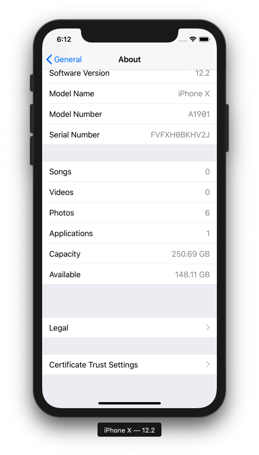
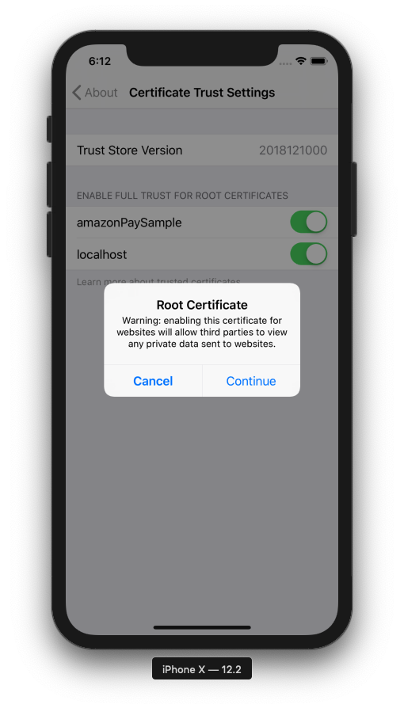

# Amazon Pay モバイル サンプルアプリ iOS(iPhone, iPad)版
下記のiOSアプリの実装です。
https://github.com/tauty/amazonpay-mobile-sample_server

## 動作環境
Apple iOS バージョン11.2以降: Safari Mobile 11以降  
[参考] https://pay.amazon.com/jp/help/202030010

## Native版
通常のiOSアプリ向けの実装サンプルです。  

### アプリ側に購入ボタンがあるフロー
アプリ側で商品の購入数を選んで受注情報を作成し、SFSafariViewを起動してAmazon Payへのログインしてデフォルトの住所＆支払い方法を取得し、アプリに戻って確認画面を表示して購入を実施します。  


住所・支払い方法を変更したい場合には確認外面で「送付先・支払い変更」ボタンをクリックして再度ブラウザを立ち上げて選択します。

  

詳細は、[flow-ios.xlsx](./flow-ios.xlsx)の「Native - app決済」タブ参照。  
※ 同flowには各処理のURL, 処理するClass名、HTMLテンプレート名なども記載されているので、サンプルコードを読む時にもご参照ください。

### 起動したブラウザ側に購入ボタンがあるフロー
アプリ側で商品の購入数を選んで受注情報を作成し、SFSafariViewを起動してAmazon Payへのログイン・住所＆支払い方法の選択・購入を実施し、またアプリ側に戻って購入完了画面を表示します。  
  

詳細は、[flow-ios.xlsx](./flow-ios.xlsx)の「Native - safari決済」タブ参照。  
※ 同flowには各処理のURL, 処理するClass名、HTMLテンプレート名なども記載されているので、サンプルコードを読む時にもご参照ください。

## WebView版
WebView(アプリ内ブラウザ)を使ったアプリ向けの実装サンプルです。  

### アプリ側に購入ボタンがあるフロー
基本的な流れはNative版と同じで、WebView内で商品の購入数を選んで受注情報を作成し、SFSafariViewを起動してAmazon Payへのログインしてデフォルトの住所＆支払い方法を取得し、アプリに戻って確認画面を表示して購入を実施します。  
※ Amazon Payではセキュリティ確保のため、URLを隠したり偽装したりできてしまうWebView上でのログイン処理を原則禁止しております。そのため、本サンプルのようにSFSafariViewへ処理を飛ばす必要があります。


住所・支払い方法を変更したい場合には確認外面で「送付先・支払い変更」ボタンをクリックして再度ブラウザを立ち上げて選択します。

詳細は、[flow-ios.xlsx](./flow-ios.xlsx)の「WebView - app決済」タブ参照。  
※ 同flowには各処理のURL, 処理するClass名、HTMLテンプレート名なども記載されているので、サンプルコードを読む時にもご参照ください。

### 起動したブラウザ側に購入ボタンがあるフロー
こちらもNative版と同じで、アプリ側で商品の購入数を選んで受注情報を作成し、SFSafariViewを起動してAmazon Payへのログイン・住所＆支払い方法の選択・購入を実施し、またアプリ側に戻って購入完了画面を表示します。


詳細は、[flow-ios.xlsx](./flow-ios.xlsx)の「WebView - safari決済」タブ参照。  
※ 同flowには各処理のURL, 処理するClass名、HTMLテンプレート名なども記載されているので、サンプルコードを読む時にもご参照ください。

## UIWebView版
WebView(アプリ内ブラウザ)の中でも旧バージョンの、UIWebViewを使ったアプリ向けの実装サンプルです。  
動作や見た目は全くWebView版と同じですが、SFSafariViewの起動方法に一部違いがあります。

詳細は、[flow-ios.xlsx](./flow-ios.xlsx)の「UIWebView - app決済」「UIWebView - safari決済」タブ参照。  
※ 同flowには各処理のURL, 処理するClass名、HTMLテンプレート名なども記載されているので、サンプルコードを読む時にもご参照ください。

# iOS版サンプルアプリのインストール

## プロジェクトのclone
まずは、clientのiOS(iPhone, iPad)側にあたる本プロジェクトをcloneしてください。  
```
git clone https://github.com/tauty/amazonpay-mobile-sample_ios.git
```

## プロジェクトのOpenとサンプルアプリの起動
本プロジェクトは、Mac上の[Xcode](https://developer.apple.com/jp/xcode/)で開きます。そのほかの環境での開き方は、ここでは扱いません。  
※ ここではversion 10.2.1を使用しています。  
まずはXcodeを立ち上げます。  

「Open another project」で、cloneしたプロジェクトを選択して、「Open」  
プロジェクトが開いたら、Menuの「Product」→「Run」か、画面上部の「Run」ボタンより、applicationを起動してください。

Simulatorが立ち上がり、サンプルアプリが起動します。(1〜2分かかります。)  


## 自己証明書のインストール
今回のサンプルでは、server側のSSL証明書に自己証明書が使用されているため、サンプルアプリを正しく動作させるためにはその自己証明書をiOS側にInstallする必要があります。  
ここでは、起動したSimulatorへのInstall方法を説明します。
※ 以下はiOS12.2で実施しておりますが、iOSのバージョンによっては手順が若干違う場合があります。

1. SSL自己証明書のDownload  
Safariを立ち上げ、下記のURLにアクセスします。(Chrome等の他のブラウザだとうまくいかないことがあるので、必ずSafariをご使用ください。)  
https://localhost:8443/crt/sample.crt  
下記のように警告が出るので、「Show Details」  
  
「visit this website」のリンクをタップし、表示されたダイアログで再度「Visit Website」をタップ  
  
「Allow」をタップし、で開いたダイアログで「Close」をタップ  
  

2. SSL自己証明書のInstall  
Safariを閉じて、「Settings」 →　「General」 → 「Profile」  
今ダウンロードされた「localhost」をタップ  
  
「Install」をタップし、開いたダイアログで再度「Install」をタップ  
  
Installが完了します。  
  

3. SSL自己証明書の有効化  
「Settings」 →　「General」 → 「About」で下記を開いて、「Certificate Trust Settings」  
  
先ほどInstallした「localhost」をONにし、表示されたダイアログで「Continue」をタップして有効化します。  
  

あとはSimulator上でサンプルアプリを立ち上げて動作をご確認ください。

# Login with Amazonと会員連携について
今回のサンプルで提示した方式を応用することで、Amazon Accountを用いた会員連携も実現できます。
実装イメージは、[flow-ios-login.xlsx](./flow-ios-login.xlsx)をご参照ください。  
※ 参考 - Login with Amazonの詳細: https://developer.amazon.com/ja/docs/login-with-amazon/web-docs.html
